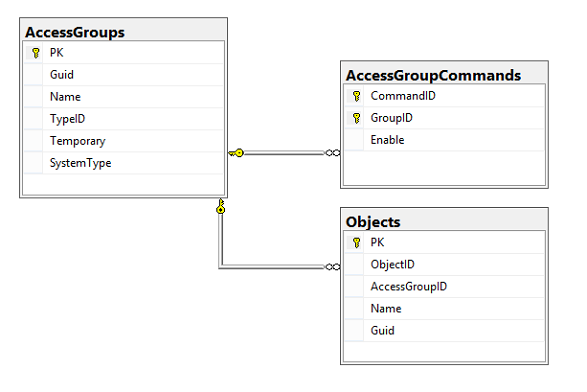

# Тестовое задание "Топ Системы"

## Исходный текст задания

[С оригинальным документом можно ознакомиться по ссылке](./doc.doc.pdf) Далее, частичная копия текста приведена для удобства.

### ОСНОВНЫЕ ТЕСТОВЫЕ ЗАДАНИЯ

### ИСХОДНЫЕ ДАННЫЕ

База данных `TESTS_SOURCE` содержит три таблицы, в которых хранятся описания групп прав доступа и коды команд, которые разрешены или запрещены для данных групп, а также таблица со списком объектов - Objects[^atText1].

Группы хранятся в таблице `AccessGroups`, допустимые или запрещённые команды – в `AccessGroupCommands`.

1. Есть некий стандартный набор групп прав доступа (хранится в `AccessGroups`):

2. Каждая из таких групп содержит перечень разрешённых или запрещённых команд (хранятся в `AccessGroupCommands`, где `GroupID` соответствует PK из таблицы `AccessGroups`[^atText2]):

3. Существует некий список объектов, для которых требуется назначить права доступа (`Objects`):

Картинки в списке опущены поскольку в наличии код сценария создания исходных баз.

Группа прав доступа `AccessGroupID` таблицы `Objects` соответствует PK из таблицы AccessGroups.

Предположим, что ответственный за управление доступами назначил каждому объекту не какой-то стандартный набор[^atText3] доступов из списка п.1 (например, «Просмотр»), а для каждого объекта создавал новый набор, в котором указывал разрешённые и запрещённые команды, а затем применял его к этому объекту. В итоге для всех объектов в списке образовалось такое же количество новых групп прав доступа, часть которых дублирует друг друга.

> Примечания:  
У стандартных групп значение колонки Temporary равно нулю, у групп, которые были созданы явно для каждого объекта из списка п.3 – равно единице.
В приложении №1 находится скрипт, который создаёт две тестовые базы данных (перед выполнением требуется исправить пути к файлам!) и заполняет требуемыми исходными данными первую базу.

ТЕСТОВОЕ ЗАДАНИЕ №1  
Требуется создать новую базу данных TEST_DEST, с идентичными таблицами, с одной оговоркой – в таблице AccessGroups значения первичного ключа должны начинаться со значения 1000 и генерироваться с шагом 50. Далее необходимо скопировать информацию о группах прав доступа и их командах, сохранив содержимое групп, а также содержимое таблицы Objects, также сохраняя права доступа.

ТЕСТОВОЕ ЗАДАНИЕ №2  
После выполнения тестового задания №1 требуется исправить ситуацию с избыточностью групп прав доступа, т.е. заменить все идентичные по командам группы прав доступа, которые были созданы для объектов списка п.3, на первые подходящие группы. При этом требуется удалить лишние группы и их команды из таблиц,  
Далее необходимо преобразовать временные группы в постоянные (указав значение колонки Temporary равным 0 и задав какое-то название группы вместо пустой строки).
 
ПРИМЕЧАНИЕ: Перед отправкой результатов на проверку проверьте, выполняются ли ваши скрипты, соответствуют ли результаты работы ваших скриптов условиям заданий.

[ПРИЛОЖЕНИЕ №1](./appendix.tsql)

## Декомпозиция

### Трактовка условия:

Дана таблица `Objects`, в ней хранятся защищаемые объекты.  

Так же, таблица `AccessGroupCommands`, в ней хранятся операции которые можно применять к защищаемыми объектами. Команды могут быть включены или выключены (это следует из схемы данных, так как сопоставленная объекту но запрещенная команда не имеет смысла, а характер сопоставления не раскрыт) Трактовка предлагается иная. Приоритетным предлагаю считать флаг разрешения для применения при наличии связи, таким образом сброшенный флаг может говорить об отсутствии связи. Включение в ключ, полей `CommandID` и `GroupID` однозначно говорит только о том, что для каждой группы команда встречается только один раз. Так же возможно каждая группа подразумевает, но не гарантирует, полный набор доступных команд, что делает затруднительным редактирование списка команд.  

Так же, между таблицами `Objects` и `AccessGroupCommands` построена связь через таблицу `AccessGroups`, которая устанавливает соответствие объект\команда (many to many). Связь со стороны `AccessGroupCommands` дополнена флагом, разрывающим ее в случае сброшенного состояния флага.  
В примечании говорится о двух типах связей (групп) таблицы `AccessGroups`: о "постоянной" и о "временной". Тип регулируется флагом `Temporary` (значение 0 - постоянный).  

О характере данных говорится, что кроме _постоянных групп_ в данных присутствуют и _временные группы_, на которые возможно ссылаются объекты. Далее формулировки не четкие, понять однозначно их нельзя, по этому остается делать предположения о том что:  

  - под _набором_ подразумевается запись в таблицу групп `AccessGroups` и записи в таблицу команд `AccessGroupCommands` со ссылками на новую запись в таблицу группы
  - под _указанием команд_ подразумевается создание или изменение записи в `AccessGroupCommands` с установкой флага `Enable`
  - под _применением к объекту_ подразумевается изменение поля `AccessGroupsID` таблицы `Objects` значением идентификатора новой созданной группы
  - следующее предложение совсем сложно понять.. можно предположить, по основаниям: 
    - либо: для всех записей из `Objects` произошло изменение поля `AccessGroupsID` на значение идентификатора новой созданной в `AccessGroups` (возможно последней из множества созданных)
    - либо: для всех записей `Objects` стал доступен новый идентификатор временной группы, под _таким же количеством_ наверное подразумевается количество новых, созданных ответственным, групп; при этом фраза _часть которых дублирует друг друга_ возможно значит наличие набора записей из `AccessGroupCommands` который отличен от какого то другого из той же таблицы только значением поля `GroupID` (значения остальных полей и количество записей в сравниваемых наборах идентичны)
    - либо: `AccessGroups` создана запись, отличающаяся от какой либо другой только идентификатором (и как копия временной в том числе), при этом не известно, что произошло в таблице `AccessGroupCommands`

Последние две ситуации выглядят странно, но в рамках схемы данных они доступны следовательно это может быть нормальным поведением приложения, поскольку идентичный набор команд (пустой в том числе) отличающийся именем может быть создан в административных целях. Уплотнение `AccessGroupCommands` может привести к созданию экземпляра записи в `AccessGroupCommands` для разных групп из `AccessGroups`, что приведет к неявной ошибке с изменением доступа для не связанных групп во время редактирования правила для одной. Таким образом ситуации избыточности в этой конфигурации быть не может, поскольку не приведен критерий сравнения на идентичность записей групп и невозможно создавать записи ссылок команд на разные группы одновременно.

### Трактовка заданий:

#### Код инициализации

Код реализации в [файле](./task_init.tsql)  

#### Задача 1:

Код реализации в [файле](./task_01.tsql)  

Предлагается сделать копию базы изменив значения PK таблицы `AccessGroups`. Фразы задачи _сохранив содержимое групп_ и _также сохраняя права доступа_ не понятны, поскольку используют не точную терминологию. Буду считать, что во время копирования в процессе замены ключей таблицы `AccessGroups` нужно сохранять исходную структуру данных с заменой значений ссылок в таблицах `AccessGroupCommands` и `Objects` на вновь сгенерированные соответственно копируемой структуре.  

#### Задача 2:

Код реализации в [файле](./task_02.tsql)  

Так же для неточностей формулировки задания выберу следующие трактовки:

  - _ситуации с избыточностью групп прав доступа_ не существует, по этому предположу, что код процедуры будет приводить к ошибками приложения, приведу его для выполнения условий задачи
  - _первые подходящие группы_ буду трактовать как любые группы из множеств временных и постоянных без различия, поскольку не приведен критерий сортировки, однако, отдавая предпочтение постоянным
  - _лишними группами_ буду считать группы для которых ранее найдены эквивалентные, а именно те в которых разница в множестве команд как упомянуто выше состоит только в значении поля `GroupID` таблицы `AccessGroupCommands`, сравнение на эквивалентность значений `AccessGroups` проводиться не будет, то есть группы например с разными названиями или признаками постоянности буду считаться эквивалентными

То есть задача состоит в том чтобы удалить ранее созданные временные группы в случае если наборы их команд отличаются только идентификатором группы. Далее необходимо так же удалить команды со ссылками на группы которых не существует после удаления групп. Так же необходимо обновить таблицу объектов, изменив ссылку на группу `AccessGroupsID` таблицы `Objects`. Так же необходимо преобразовать все оставшиеся после операции группы в постоянные, обновив поле `Temporary`. Так же необходимо заполнить чем-нибудь поле `Name` таблицы `AccessGroups` если оно пустое или его значение читается как пустое.

### Замечания:

Что-то похожее на тесты, разработано для личного пользования в процессе проектирования и не является тестами в полной мере. Прошу их не учитывать во время оценки выполнения.
